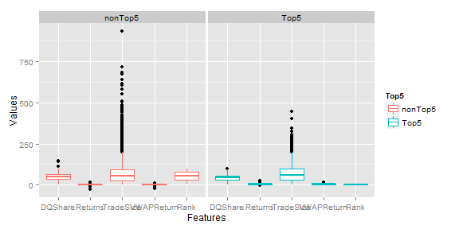
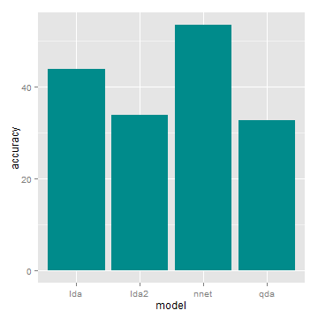

***
### Loading the data:

```r
require(caret)
require(dplyr)
require(tidyr)
load('input.RData')
                       
summary(eqcnx100adj)
```

```
##       Date                        Ticker              Close        
##  Min.   :2014-01-01 00:00:00   Length:29000       Min.   :   55.1  
##  1st Qu.:2014-04-16 00:00:00   Class :character   1st Qu.:  232.6  
##  Median :2014-07-31 12:00:00   Mode  :character   Median :  461.7  
##  Mean   :2014-08-03 08:21:31                      Mean   : 1037.0  
##  3rd Qu.:2014-11-24 00:00:00                      3rd Qu.: 1079.9  
##  Max.   :2015-03-09 00:00:00                      Max.   :27117.7  
##    PrevClose            VWAP             DQShare           Returns        
##  Min.   :   55.1   Min.   :   55.08   Min.   :  1.901   Min.   :-28.5600  
##  1st Qu.:  232.2   1st Qu.:  232.92   1st Qu.: 35.574   1st Qu.: -1.0100  
##  Median :  460.8   Median :  461.94   Median : 50.249   Median :  0.0700  
##  Mean   : 1035.0   Mean   : 1037.71   Mean   : 49.629   Mean   :  0.1485  
##  3rd Qu.: 1078.4   3rd Qu.: 1080.44   3rd Qu.: 63.498   3rd Qu.:  1.2300  
##  Max.   :27117.7   Max.   :26663.56   Max.   :145.616   Max.   : 25.7500  
##    TradeSize         VWAPReturn             Rank            Top5          
##  Min.   :  1.866   Min.   :-23.77470   Min.   :  1.00   Length:29000      
##  1st Qu.: 23.068   1st Qu.: -0.87232   1st Qu.: 25.75   Class :character  
##  Median : 52.632   Median :  0.09071   Median : 50.50   Mode  :character  
##  Mean   : 70.913   Mean   :  0.14494   Mean   : 50.50                     
##  3rd Qu.: 94.206   3rd Qu.:  1.11004   3rd Qu.: 75.25                     
##  Max.   :934.764   Max.   : 17.51220   Max.   :100.00
```

```r
gridExtra::grid.arrange(ggplot(eqcnx100adj, aes(x = 1, y = DQShare, col = Top5)) + geom_boxplot(), ggplot(eqcnx100adj, aes(x = 1, y = TradeSize, col = Top5)) + geom_boxplot(), ggplot(eqcnx100adj, aes(x = 1, y = VWAPReturn, col = Top5)) + geom_boxplot(), ggplot(eqcnx100adj, aes(x = 1, y = Returns, col = Top5)) + geom_boxplot(), nrow = 2)
```

 

```r
eqcnx100adj[,-c(3:5)] %>%
  #select(DQShare:VWAPReturn, Top5) %>%
  gather(Features, Values, -c(Top5, Date, Ticker)) %>%
  ggplot(aes(x = Features, y = Values, col = Top5)) + 
  geom_boxplot() + facet_wrap( ~ Top5)
```

 

***
### Performance of the models:

```r
trainSet = eqcnx100adj[1:24400, -10]
testSet = eqcnx100adj[24401:29000, -10]

ldaModel = train(factor(Top5) ~. - Date - Ticker , data = trainSet, method = 'lda')
pred.lda = predict(ldaModel, testSet)

ldaModel2 = train(factor(Top5) ~ DQShare + Returns + TradeSize, data = trainSet, method = 'lda')
pred.lda2 = predict(ldaModel2, testSet)

qdaModel = train(factor(Top5) ~. - Date - Ticker, data = trainSet, method = 'qda')
pred.qda = predict(qdaModel, testSet)

nnetModel = train(factor(Top5) ~. - Date - Ticker, data = trainSet, method = 'nnet')
pred.nnet = predict(nnetModel, testSet)

results = cbind(testSet$Top5, as.character(pred.lda), as.character(pred.lda2),
                as.character(pred.qda), as.character(pred.nnet))
colnames(results) = c('testSet', 'pred.lda', 'pred.lda2', 'pred.qda', 'pred.nnet')
results = as.data.frame(results)

intSet = results[results$testSet=='Top5', ]
accuracy = 100* c(sum(intSet$testSet == intSet$pred.lda)/NROW(intSet),
             sum(intSet$testSet == intSet$pred.lda2)/NROW(intSet),
             sum(intSet$testSet == intSet$pred.qda)/NROW(intSet),
             sum(intSet$testSet == intSet$pred.nnet)/NROW(intSet))
accuracy = as.data.frame(accuracy)
accuracy$model = c('lda', 'lda2', 'qda', 'nnet')

ggplot(accuracy, aes(x = model, y = accuracy)) + 
  geom_bar(stat = 'identity', fill = 'cyan4')
```

 

